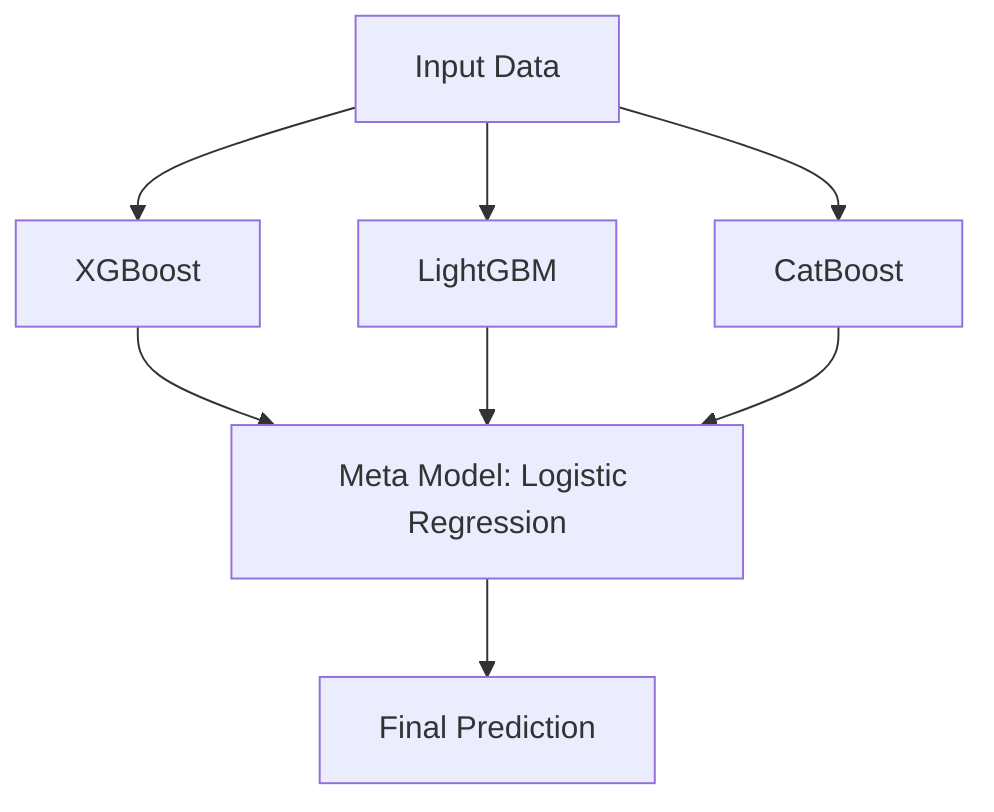

---
categories:
- Kaggle Challenges
- Machine Learning Projects
date: 2024-09-16
description: Sixth day of my Kaggle challenge with a multi-class prediction model
  for obesity risk using various ML techniques and tuning XGBoost.
draft: false
image: /assets/images/Multi-Class-Obesity-Prediction-with-ML.png
lastUpdated: 2024-09-16
layout: layouts/post.html
permalink: /blog/multi-class-prediction-of-obesity-risk/
tags:
- Multiclass-Classification
- XGBoost
- Model-Stacking
- 30-Kaggle-Challenges
- Hyperparameter-Tuning
title: Multi-Class Prediction of Obesity Risk
---

## Introduction


Today is the sixth day of the [30 Kaggle Challenges in 30 Days](https://surajwate.com/projects/30-days-of-kaggle-challenges/) challenge. I am wondering if I should keep these blogs static or dynamic. I am building very basic ML models right now. Should I come back to these blogs in the future and add new ML models by updating them, or should I create new ones later on and link them to these blogs? I am unsure of it right now. Well, I will add this to my to-do list. Returning to the challenge, it is a multi-class prediction model. Keep in mind that it’s multi-class and not multi-label. There is a difference between the two. We will explore this difference as we solve the problem.

## Data Overview


Kaggle Dataset: [Season 4, Episode 2](https://www.kaggle.com/competitions/playground-series-s4e2/data)
Original dataset: [Obesity or CVD risk](https://www.kaggle.com/datasets/aravindpcoder/obesity-or-cvd-risk-classifyregressorcluster)

### Data Description

The dataset for this competition is synthetically generated from Obesity or CVD risk dataset. The original data consists of the estimation of obesity levels in people from the countries of Mexico, Peru, and Colombia, with ages between 14 and 61 and diverse eating habits and physical conditions. The description of the columns is as follows:

- `Gender`: Gender of the person
- `Age`: Age of the person
- `Height`: Height of the person
- `Weight`: Weight of the person
- `family_history_with_overweight`: If the person has a family history of being overweight
- `FAVC`: Frequent consumption of high-caloric food
- `FCVC`: Frequency of consumption of vegetables
- `NCP`: Number of main meals
- `CAEC`: Consumption of food between meals
- `SMOKE`: If the person smokes
- `CH2O`: Consumption of water daily
- `SCC`: Calories consumption monitoring
- `FAF`: Physical activity frequency
- `TUE`: Time using technology devices
- `CALC`: Consumption of alcohol
- `MTRANS`: Transportation used
- `NObeyesdad`: Obesity level


### Kaggle Datasets

Kaggle has provided three data files for this competition:

- `train.csv`: This training dataset contains the features and the target variable.
- `test.csv`: This test dataset contains the features.
- `sample_submission.csv`: This sample submission file shows the correct submission format.


### Data Files

| File | Rows | Columns | 
| ---- | ---- | ------- |
| train.csv | 20758 | 18 |
| test.csv | 13840 | 17 |


The training dataset has 18 columns: 16 are features, 1 is ID, and 1 is the target variable, `NObeyesdad`.

### Variable Details

From a total of 17 variables, 8 are categorical features, 8 numerical features and 1 target variable.

#### Missing Values

Check the training set for missing values. The dataset does not have any missing values.

#### Target Variable

Data have 7 levels of obesity.

```txt
Obesity_Type_III       4046
Obesity_Type_II        3248
Normal_Weight          3082
Obesity_Type_I         2910
Insufficient_Weight    2523
Overweight_Level_II    2522
Overweight_Level_I     2427
```


Although the target variable doesn’t have a huge imbalance, we will still monitor its effect on the model’s performance.


#### Gender


Most females have obesity type III, while obesity type II is prevalent in males.


#### Other Variables Features

I can’t upload all the plots, but if you are interested you can check the notebook in GitHub. I will write the detail analysis of all the features.

91.44% of people said that they frequently consume high-calorie food. 84.44% said they do consume food between the means sometimes. 98.82% of people smoke.

The majority of the respondents are in their 20s. The respondents’ heights are normally distributed, with the mean and median both around 1.7 meters. The weight distribution is spread out but doesn’t have any outliers. The number of meals has 29.15% outliers. It ranges from 1 to 3 meals a day, with most people consuming three meals per day.

## Preprocessing

There are 8 categorical features in total, which will be encoded using one hot encoding. The scaling will be done to numerical features. Only one feature has outliers, but the values are understandable, as some people might have only one meal due to diet or any other reason, and it’s perfectly possible for some to have four meals.


## Model Selection

- Discuss the model considered and the reasons for choosing specific algorithms.
- Include a brief description of hyperparameters tuning or techniques like cross-validation.


## Evaluation


Here’s a table summarizing the accuracy scores from each model across the 5-folds:

| **Model**              | **Fold 0** | **Fold 1** | **Fold 2** | **Fold 3** | **Fold 4** | **Average Accuracy** |
|------------------------|------------|------------|------------|------------|------------|----------------------|
| **Logistic Regression** | 0.8687     | 0.8651     | 0.8683     | 0.8533     | 0.8598     | 0.8630               |
| **Random Forest**       | 0.8993     | 0.8878     | 0.8890     | 0.8841     | 0.8909     | 0.8902               |
| **Decision Tree**       | 0.8408     | 0.8509     | 0.8413     | 0.8497     | 0.8511     | 0.8468               |
| **SVM**                 | 0.8866     | 0.8789     | 0.8779     | 0.8702     | 0.8755     | 0.8778               |
| **Gradient Boosting**   | 0.9085     | 0.9082     | 0.9039     | 0.8993     | 0.9041     | 0.9048               |
| **XGBoost**             | 0.9114     | 0.9102     | 0.9070     | 0.8991     | 0.9046     | 0.9065               |
| **KNN**                 | 0.7604     | 0.7577     | 0.7575     | 0.7572     | 0.7545     | 0.7575               |
| **Extra Trees**         | 0.8666     | 0.8557     | 0.8615     | 0.8535     | 0.8624     | 0.8599               |
| **AdaBoost**            | 0.4725     | 0.4321     | 0.6671     | 0.4054     | 0.6630     | 0.5280               |
| **Bagging**             | 0.8875     | 0.8911     | 0.8849     | 0.8817     | 0.8851     | 0.8861               |
| **LightGBM**            | 0.9128     | 0.9092     | 0.9063     | 0.9024     | 0.9015     | 0.9064               |
| **CatBoost**            | 0.9128     | 0.9051     | 0.9063     | 0.8988     | 0.9085     | 0.9063               |

### Key Takeaways:
- **Best Performers**: XGBoost, LightGBM, and CatBoost all achieved accuracy scores around **90.6%** to **91.1%**.
- **Worst Performers**: AdaBoost had a poor average accuracy of around **52.8%**.
- **KNN** also performed below expectations, with an average accuracy of **75.75%**.


### Stacking

Stacking, also called as stacked generalization, is using the output of the few base model and fit the results on another model called "meta model" to make predictions.
I stacked the three top-performing models to check whether the score improved. I used logistic regression as the meta-model for stacking.




<!-- Description for accessibility and SEO --> 
**Diagram**: This diagram shows the stacking of XGBoost, LightGBM, and CatBoost models with Logistic Regression as the meta-model, used for final prediction.


```python
base_models = [
    (‘xgboost’, XGBClassifier()),
    (‘lightgbm’, LGBMClassifier()),
    ('catboost', CatBoostClassifier(verbose=0)),
]

# Meta model
meta_model = LogisticRegression()

# Define the stacking classifier
stacking_model = StackingClassifier(estimators=base_models, final_estimator=meta_model)
```

I got a slight improvement in the result by using stacking.

| Meta Model          | Fold 0 | Fold 1 | Fold 2 | Fold 3 | Fold 4 | Average Accuracy |
| ------------------- | ------ | ------ | ------ | ------ | ------ | ---------------- |
| Logistic Regression | 0.9133 | 0.9087 | 0.9078 | 0.8998 | 0.9060 | 0.90712          |
| Random Forest       | 0.9104 | 0.9063 | 0.9087 | 0.9012 | 0.9034 | 0.90600          |
| XGBClassifier       | 0.9106 | 0.9022 | 0.9058 | 0.8950 | 0.9020 | 0.90312          |

This table compares performance across three different meta-models: Logistic Regression, Random Forest, and XGBClassifier.


### XGBoost

The performance of stacking and XGBoost is very close. Since it’s efficient to run a random grid search on XGBoost, I selected it.
Following are the results of a random grid search with XGBoost across different folds:

| Fold 0 | Fold 1 | Fold 2 | Fold 3 | Fold 4 | Average Accuracy |
|--------|--------|--------|--------|--------|------------------|
| 0.9162 | 0.9106 | 0.9092 | 0.9020 | 0.9073 | 0.90906          |

```python
{'model__subsample': 0.8, 'model__n_estimators': 300, 'model__max_depth': 3, 'model__learning_rate': 0.1, 'model__colsample_bytree': 1.0}
```

I ran a grid search to improve my score. The following is the result. However, it took me around 71 minutes. 

```bash
└─Δ python .\src\grid_search.py --model xgboost
Fitting 5 folds for each of 256 candidates, totalling 1280 fits
Fold=0, Accuracy = 0.9135, Time Taken=881.79sec
Fitting 5 folds for each of 256 candidates, totalling 1280 fits
Fold=1, Accuracy = 0.9126, Time Taken=862.09sec
Fitting 5 folds for each of 256 candidates, totalling 1280 fits
Fold=2, Accuracy = 0.9126, Time Taken=806.86sec
Fitting 5 folds for each of 256 candidates, totalling 1280 fits
Fold=3, Accuracy = 0.9012, Time Taken=855.28sec
Fitting 5 folds for each of 256 candidates, totalling 1280 fits
Fold=4, Accuracy = 0.9123, Time Taken=854.84sec
```


## Results

I have decided to submit two versions of the XGBoost models, one without hyperparameter tuning and one after tuning. The accuracy scores I achieved for both submissions are as follows:

**XGBoost (Without Tuning)**: 0.90191
**XGBoost (After Tuning)**: 0.90561


The first result kept me between 1973 and 1992 in ranking, while the second result kept me between 1258 and 1279. You can see that the difference of 0.0037 accuracy score shifted the rank by around 715 levels. 


## Key Learning


For certain types of models, you have to label encode and inversely label encode the target variable to get back the results in string format. The reason is that some models don’t work with target variables in string format.
After building the model, you get the result in numerical format. So, you have to inverse the label encoding of the target variable to convert it back into its original string representation.
- While doing preprocessing, address a situation where test data might have a value not present in the original dataset.


## Conclusion

It was a hectic day, finishing this blog on the second day because I was exhausted yesterday. I wrote the result of only one grid search that took me 71 minutes, but I ran many such grid searches. There is a limit on how much score one can improve by doing hyperparameter optimization. Because it takes so much time, I can’t we can justify the cost of resources. I only have a little time and resources. Because when I ran the model, I couldn’t do anything on my system. So, I decided that from tomorrow onwards; I would check other things, like feature engineering and advanced models, but not hyperparameter optimization, for the 30-day Kaggle challenge. I won’t be able to complete all the problems if I spend so much time on a single problem. My main focus should be covering as many problems as possible. After finishing this challenge, I can improve each problem’s score and write a second blog post about each.


## Links


**Notebook**: [Kaggle Notebook for S4E3](https://www.kaggle.com/code/surajwate/s4e2-prediction-of-obesity-risk)
**Code**: [GitHub Repository for Day 5](https://github.com/surajwate/S4E2-Multi-Class-Prediction-of-Obesity-Risk)