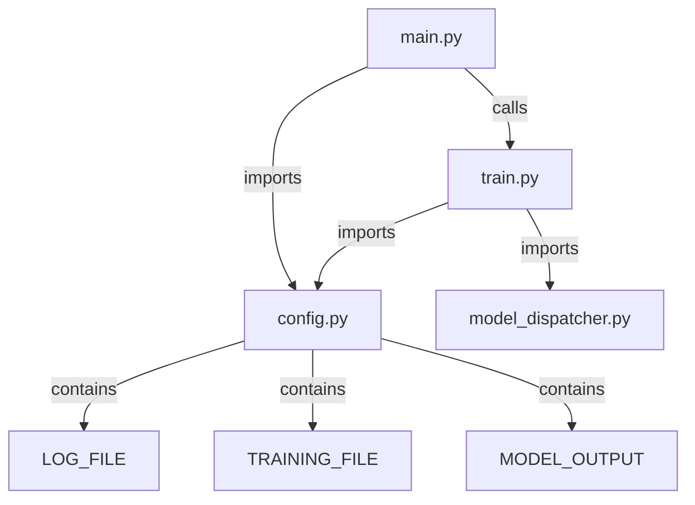

## Day 3 of Kaggle Challenge: Improving Workflow


Today is the third day of my challenge, and writing about each problem in the same manner is getting monotonous. I already have the [Kaggle notebook](https://www.kaggle.com/competitions/playground-series-s4e5) if anyone is interested in code. So, from now on, I will write less code in each blog. Instead, I will write about the experience and the thought process behind each step. In that way, the blog will look more like a blog and less like coding documentation as I can always write detailed documents in the [GitHub repository](https://github.com/surajwate/S4E5-Flood-Prediction-Dataset). 

## The Problem: Flood Probability Prediction

In today's problem, we must predict the probability of flooding in the region. We are given the data with various features which might be responsible for the flood.


### Dataset Overview

We start by checking for missing values in the dataset. This is cleaned data, so there are no missing values. The size is normal. The train data set has 1117957 rows and 22 columns, while the test dataset has 745305 rows. If we remove the `id` and `FloodProbability` columns, we have 20 features. The goal is to predict the probability of floods.

### Initial Exploration

I check the count of unique values in the train set to understand the nature of the data. It is as follows:

```txt
Monsoon Intensity                    17
Topography Drainage                  19
River Management                     17
Deforestation                        18
Urbanization                         18
ClimateChange                        18
Dams Quality                         17
Siltation                            17
Agricultural Practices               17
Encroachments                        19
Ineffective Disaster Preparedness    17
Drainage Systems                     18
Coastal Vulnerability                18
Land slides                          17
Water sheds                          17
Deteriorating Infrastructure         18
Population Score                     19
Wetland Loss                         20
Inadequate Planning                  17
Political Factors                    17
Flood Probability                    83
```

All the features have 17 to 19 unique values. Unfortunately, I can't see what each of these values means. The repository of the original dataset from which the dataset for this challenge is synthetically generated is not available. Most probably, the user deleted that dataset. If any of the readers found the original data, please leave a comment, and I will try to incorporate that information in this blog. 

### Assumptions and Next Steps

Since the unique values for each feature are quite high, I will consider each feature a numerical feature.

I checked the distribution of the target variable, ie. `FloodProbability`. It follows the bell curve; their distribution is normal, with around 0.5% outliers.


## Preprocessing

I have created a stratified k-fold from the train set. The only preprocessing I did was scaling the data using StandardScaler().


## Project Structure

Today, I spent most of the time building a good project structure rather than building a machine-learning model, but I like the result. You can check all the code in this project's GitHub repository. The following is the diagram of all files. I have automated all the processes, so you can build any model with a single command line.

You run the single command line, like:
```cmd
python main.py --model xgboost
```

This command runs `main.py`, which in turn will `train.py`. The `train.py` imports model from `model_dispatcher` and other configuration like location of files and logging setting from `config.py`. Below is a diagram of the project structure:





## Model Performance

### CatBoostRegressor

Through this pipeline, I have run 10 different ML models. `CatBoostRegressor()` has given me the best result. These are as follows:

```cmd
Fold=0, R2 Score=0.8469, Time Taken=45.84sec
Fold=1, R2 Score=0.8468, Time Taken=47.96sec
Fold=2, R2 Score=0.8459, Time Taken=47.61sec
Fold=3, R2 Score=0.8463, Time Taken=49.09sec
Fold=4, R2 Score=0.8456, Time Taken=51.46sec
```

### Linear Regression

Interestingly, the second-best result came from `LinearRegressor()`, a simple model that performed surprisingly well:

```cmd
Fold=0, R2 Score=0.8455, Time Taken=0.53sec
Fold=1, R2 Score=0.8454, Time Taken=0.42sec
Fold=2, R2 Score=0.8445, Time Taken=0.45sec
Fold=3, R2 Score=0.8450, Time Taken=0.55sec
Fold=4, R2 Score=0.8443, Time Taken=0.49sec
```


### Insights

The results of these two are similar, but if you check the time each takes to fit the data, there is a vast difference. If you don't need a marginal gain of prediction improvement at the cost of time, you better go with linear regression. It will save a lot of time and is easy to interpret. But we are doing a Kaggle problem where marginal gain is very important. 


I decided to build the final model on both and submit it. Check if the final score is different. According to our validation, `CatBoostRegressor()` should get a marginally higher score than `LinearRegressor()`.


## Final Result

I submitted both models to compare their final scores:

**Model**: `CatBoostRegressor()`
**$R^2$ Score**: 0.84558

**Model**: `LinearRegressor()`
**$R^2$ Score**: 0.84426

The result was on the expected line. There is a very marginal difference in score. 

## Conclusion

Today was the third day of the challenge, and I concentrated on building the workflow rather than a proper model. I realised the importance of proper workflow. It's unnecessary to write a full code each day. Therefore, I decided to build a proper system so that all things are in place and I can concentrate on feature engineering and preprocessing. I am happy that I have built a primary pipeline. From tomorrow, I will focus more on feature engineering.


**Links**:

GitHub Repository: [Flood Prediction Dataset](https://github.com/surajwate/S4E5-Flood-Prediction-Dataset)
Kaggle Notebook: [Regression with a Flood Prediction](https://www.kaggle.com/competitions/playground-series-s4e5)

